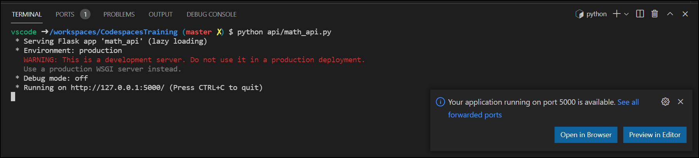
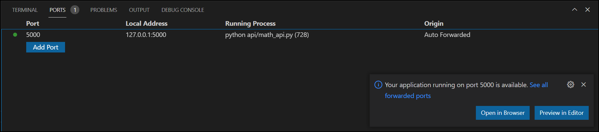
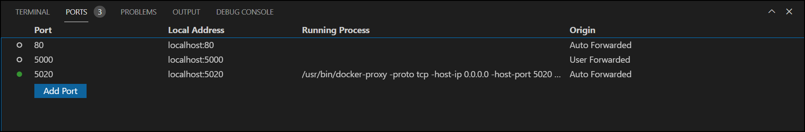

## Forwarding Ports
When running applications inside of the container, they are not accessible to the host unless you forward the port that the application is running on.  Ports can be forwarded either temporarily or you can configure your dev container to always forward the ports.
Visual Studio Code often detects ports that are running in the dev container and automatically, temporarily forwards the ports for you.  See the images below:
 

Here, you will notice that when we ran our simple Flask API, Visual Studio Code detected that the API was running on port 5000 and automatically forwarded it for us.  You can see the ports that are being forwarded on the ports tab.

There are 2 potential challenges that we may want to address:
1. We may not want to rely on Visual Studio Code to detect the ports.  This does not always happen.  In more complicated development environments, we will likely want to control what parts are forwarded.
2. We may want to provide some context as to what is running on each port via a label.
   
   In the above example, we ran the yeasy/simple-web docker image in a docker-in-docker development container.  Looking are the forwarded ports, it is unclear what is running on port 5020.

## Challenge
In this challenge, you need to accomplish 2 things:
1. Configure the dev container to forward port 5000.
2. Label port 5000 "Math API"

## Helpful Hints
[devcontainer.json reference](https://code.visualstudio.com/docs/remote/devcontainerjson-reference)
