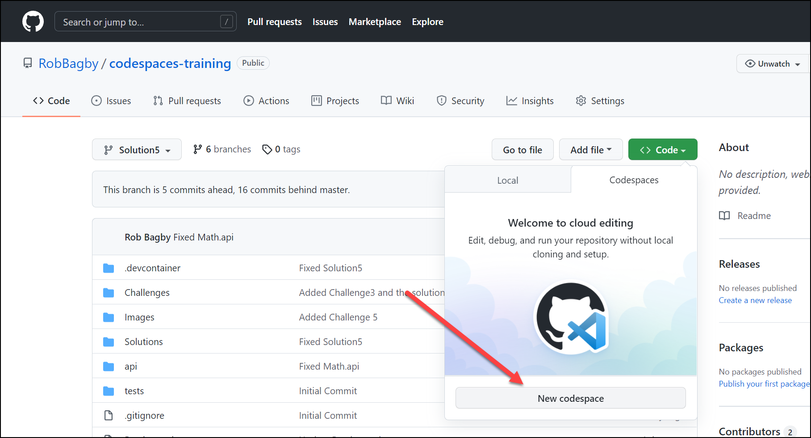

## Solution
In the Solution6.mp4 video you will see how you are able to simply click on 'New Codespace' under the '<>Code' tab in GitHub and are able to spin up a new Codespace that is hosted on a Virtual Machine at GitHub.  

You are able to take advantage of all the features you configured in the development container in the first 5 challenges including:
- Using the preconfigured development containers as a starting devcontainer
- Adding your application dependencies in the Dockerfile in the .devcontainer folder
- Forwarding ports from the devcontainer to the host so you can hit endpoints running in the devcontainer
- Adding extensions that will run on the Visual Studio Code Server running in the devcontainer

The video illustrates that a developer opening this codespace can be effective from the start because:
- The devcontainer has all dependencies 
- The devcontainer has all the required settings and extensions to be effective with Python
- The devcontainer is ready to debug the application